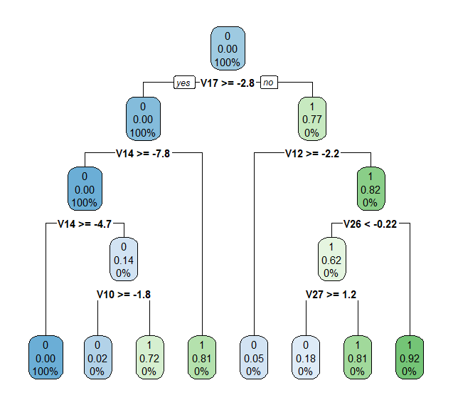

# [Group8] Credit Card Fraud Detection
#### Tags: `Imbalanced data`、`Binary classification`、`Finance`、`Credit Card transaction data`、`Time series`

### Groups
|名字|系級|學號|
|-|-|-|
|何彥南|資科碩一|110753202|
|陳偉瑄|資科碩專一|110971020|
|葉又瑄|統計三|108304046|
|鮑蕾雅|統計三|108304017|
|林佑彥|統計三|108304015|

## Goal


- 📁 **資料** 該資料集包含兩天的信用卡交易紀錄資料，包含以下特徵28個 PCA 特徵(V1 ~ V28)、交易額(Amount)、時間(Time)，預測目標為**是否為詐欺交易(Class)**。
- 😢 **困難**: 因為詐欺交易本來就是數量較少，資料呈現 ***極度不平衡*** 狀態。
- 🎯 **任務目標**: 由前面 ***40 小時*** 的資料(train)預測後面  ***8 小時*** 發生的詐欺交易(test)
- 🔗 **資料來源**: [Credit Card Fraud Detection](https://www.kaggle.com/mlg-ulb/creditcardfraud)

### Training and testing data set


### K-fold methon


### Baseline model (decision tree)
- maxdepth=10
- miinsplit=20



## Demo 
可以參考 `code/2_baseline.R`，有使用 R 的 rpart(決策樹) 作為預測模型，並在我們定義 kfold(`output/1_kfold/kfold_idx.rds`) 終測試模型穩定度，其中包含 maxdepth、minsplpit 參數測試的實驗流程
#### 決策樹的參數測試(maxdepth)


##### 1. 記錄每組實驗在各 fold 上的表現 ->  `output/2_baseline/result.maxdepth.csv`
experiment                |  fold  |  train_accuracy  |  test_accuracy  |  val_accuracy  |  test_precision  |  test_recall  |  test_f1  |  val_precision  |  val_recall  |  val_f1  |  timeuse
--------------------------|--------|------------------|-----------------|----------------|------------------|---------------|-----------|-----------------|--------------|----------|---------
decision trees(depth=1)   |  1     |  0.999           |  0.999          |  0.999         |  0.655           |  0.494        |  0.563    |  0.760          |  0.731       |  0.745   |  7.650
decision trees(depth=1)   |  2     |  0.999           |  0.999          |  0.999         |  0.655           |  0.494        |  0.563    |  0.786          |  0.740       |  0.762   |  3.657
decision trees(depth=1)   |  3     |  0.999           |  0.999          |  0.999         |  0.694           |  0.442        |  0.540    |  0.778          |  0.680       |  0.725   |  3.763
decision trees(depth=1)   |  4     |  0.999           |  0.999          |  0.999         |  0.655           |  0.494        |  0.563    |  0.731          |  0.731       |  0.731   |  3.432
decision trees(depth=5)   |  1     |  1.000           |  1.000          |  0.999         |  0.905           |  0.740        |  0.814    |  0.842          |  0.817       |  0.829   |  12.746
~  |~|~|~|~|~|~|~|~|~|~|
decision trees(depth=15)  |  4     |  1.000           |  0.999          |  0.999         |  0.847           |  0.649        |  0.735    |  0.882          |  0.721       |  0.794   |  28.960
decision trees(depth=20)  |  1     |  1.000           |  1.000          |  0.999         |  0.905           |  0.740        |  0.814    |  0.867          |  0.817       |  0.842   |  31.082
decision trees(depth=20)  |  2     |  1.000           |  0.999          |  0.999         |  0.812           |  0.727        |  0.767    |  0.865          |  0.798       |  0.830   |  29.071
decision trees(depth=20)  |  3     |  0.999           |  0.999          |  0.999         |  0.850           |  0.662        |  0.745    |  0.919          |  0.767       |  0.836   |  30.898
decision trees(depth=20)  |  4     |  1.000           |  0.999          |  0.999         |  0.847           |  0.649        |  0.735    |  0.882          |  0.721       |  0.794   |  30.682
##### 2. 每組實驗用 val 的選出 fold F1-score 表現最好的 model -> `output/2_baseline/result_best.maxdepth.csv`
experiment                |  fold  |  train_accuracy  |  test_accuracy  |  val_accuracy  |  test_precision  |  test_recall  |  test_f1  |  val_precision  |  val_recall  |  val_f1  |  timeuse  |  rank
--------------------------|--------|------------------|-----------------|----------------|------------------|---------------|-----------|-----------------|--------------|----------|-----------|------
decision trees(depth=1)   |  2     |  0.999           |  0.999          |  0.999         |  0.655           |  0.494        |  0.563    |  0.786          |  0.740       |  0.762   |  3.657    |  5
decision trees(depth=5)   |  3     |  0.999           |  0.999          |  0.999         |  0.850           |  0.662        |  0.745    |  0.919          |  0.767       |  0.836   |  12.502   |  4
decision trees(depth=10)  |  1     |  1.000           |  1.000          |  0.999         |  0.905           |  0.740        |  0.814    |  0.867          |  0.817       |  0.842   |  24.222   |  1
decision trees(depth=15)  |  1     |  1.000           |  1.000          |  0.999         |  0.905           |  0.740        |  0.814    |  0.867          |  0.817       |  0.842   |  32.459   |  1
decision trees(depth=20)  |  1     |  1.000           |  1.000          |  0.999         |  0.905           |  0.740        |  0.814    |  0.867          |  0.817       |  0.842   |  31.082   |  1
##### 3. 實驗結果比較 ->  `results/2_baseline.maxdepth.png`


##### 4. 所有實驗模型預測結果都會輸出在 -> `output/2_baseline/pred.maxdepth` 

#### 極端值處理
##### 1. 利用簡單分類器找參數
```
Rscript 3_extremes_filter_searcher.R --method IQR --range -3,3 --target 2:29 --train data/train.csv --test data/test.csv --report output/performance.ef.csv
...
Rscript 3_extremes_filter_searcher.R --method std --range -3,3 --target 3:8,11:20,22:25 --train data/train.csv --test data/test.csv --report output/performance.ef.csv
```
###### 參數結果 -> `temp/cwayneh/res/performance.ef.csv`
##### 2. 挑選參數帶入實驗模組進行實驗
```
Rscript 3_extremes_filter.R
```
##### 3. 實驗結果比較 ->  `results/3_extremes_filter.png`


##### 4. 所有實驗模型預測結果都會輸出在 -> `output/3_extremes_filter/pred.Extremes`

#### 資料不平衡處理
##### 1. 利用簡單分類器找參數
```
Rscript 4_imbalance_sampling_searcher.R --nsmp 101 --amp 100 --train data/train.csv --test data/test.csv --report performance.is.csv
...
Rscript 4_imbalance_sampling_searcher.R --nsmp 200 --amp 200 --train data/train.csv --test data/test.csv --report performance.is.csv
```
###### 參數結果 -> `temp/cwayneh/res/performance.is.csv`
##### 2. 挑選參數帶入實驗模組進行實驗
```
Rscript 4_imbalance_sampling.R
```
##### 3. 實驗結果比較 ->  `results/4_imbalance_sampling.png`


##### 4. 所有實驗模型預測結果都會輸出在 -> `output/4_imbalance_sampling/pred.Sampling`

## Folder organization and its related information
### docs
* Your presentation, 1101_datascience_FP_<yourID|groupName>.ppt/pptx/pdf, by **Jan. 13**
* 包含開會紀錄、工作進度

### data 
- `train.csv`
  - 取前 40 小時的資料 (Time 欄位 < 144000)
  - 共 224865 筆資料
  - 目標欄位 Class 比例: 0.001846 
- `test.csv` :
  - 取後 8 小時的資料 (Time 欄位 >= 144000)
  - 共 59942 筆資料
  - 目標欄位 Class 比例: 0.001285 

### code

* Which method do you use?
* What is a null model for comparison?
* How do your perform evaluation? ie. cross-validation, or addtional indepedent data set

### results
- 👑 門檻值的設定


## References
- _Tommy Huang, 機器學習: Ensemble learning之Bagging、Boosting和AdaBoost, 2018, medium. ([source](https://chih-sheng-huang821.medium.com/%E6%A9%9F%E5%99%A8%E5%AD%B8%E7%BF%92-ensemble-learning%E4%B9%8Bbagging-boosting%E5%92%8Cadaboost-af031229ebc3))_
- _Tatiana Sennikova, How to Build a Baseline Model,  2020, medium. ([source](https://towardsdatascience.com/how-to-build-a-baseline-model-be6ce42389fc))_
- _Google, Classification on imbalanced data, 2021,  Tensorflow tutorials. ([source](https://www.tensorflow.org/tutorials/structured_data/imbalanced_data))_
- _Google, Validation Set: Another Partition, 2020, google developers(Machine Learning Crash Course). ([source](https://developers.google.com/machine-learning/crash-course/validation/another-partition))_
- _rpart.control: Control for Rpart Fits, RDocumentation.  ([source](https://www.rdocumentation.org/packages/rpart/versions/4.1-15/topics/rpart.control))_
- _rpart-decision-trees-in-r, learnbymarketing. ([source](https://www.learnbymarketing.com/tutorials/rpart-decision-trees-in-r/))_
- _Ben, rpart complexity parameter confusion, 2015, stackexchange(Cross Validated).([source](https://stats.stackexchange.com/questions/117908/rpart-complexity-parameter-confusion))_

## environment
- R version 3.6.3
- rpart: 4.1-15
- ggplot2: 3.3.5
- tidyr: 1.1.3
- dplyr: 1.0.6  

### sessionInfo
#### `./docs/sessionInfo(yen-nan ho).txt`
```
R version 3.6.3 (2020-02-29)
Platform: x86_64-w64-mingw32/x64 (64-bit)
Running under: Windows 10 x64 (build 19043)

Matrix products: default

locale:
[1] LC_COLLATE=Chinese (Traditional)_Taiwan.950 
[2] LC_CTYPE=Chinese (Traditional)_Taiwan.950   
[3] LC_MONETARY=Chinese (Traditional)_Taiwan.950
[4] LC_NUMERIC=C                                
[5] LC_TIME=Chinese (Traditional)_Taiwan.950    

attached base packages:
[1] stats     graphics  grDevices utils     datasets  methods  
[7] base     

other attached packages:
[1] tidyr_1.1.3      lattice_0.20-38  rpart_4.1-15    
[4] ica_1.0-2        corrplot_0.92    factoextra_1.0.7
[7] ggplot2_3.3.5    ranger_0.12.1   

loaded via a namespace (and not attached):
 [1] tidyselect_1.1.1 purrr_0.3.4      carData_3.0-4   
 [4] colorspace_2.0-1 vctrs_0.3.8      generics_0.1.1  
 [7] utf8_1.2.1       rlang_0.4.11     ggpubr_0.4.0    
[10] pillar_1.6.2     glue_1.4.2       withr_2.4.2     
[13] DBI_1.1.1        foreach_1.5.1    lifecycle_1.0.0 
[16] plyr_1.8.6       munsell_0.5.0    ggsignif_0.6.3  
[19] gtable_0.3.0     codetools_0.2-16 labeling_0.4.2  
[22] fansi_0.4.2      broom_0.7.10     Rcpp_1.0.6      
[25] readr_1.4.0      backports_1.2.1  scales_1.1.1    
[28] abind_1.4-5      farver_2.1.0     hms_1.1.1       
[31] digest_0.6.27    rstatix_0.7.0    dplyr_1.0.6     
[34] ggrepel_0.9.1    grid_3.6.3       cli_2.5.0       
[37] tools_3.6.3      magrittr_2.0.1   tibble_3.1.1    
[40] crayon_1.4.1     car_3.0-12       pkgconfig_2.0.3 
[43] ellipsis_0.3.2   MASS_7.3-51.5    Matrix_1.2-18   
[46] assertthat_0.2.1 rstudioapi_0.13  iterators_1.0.13
[49] R6_2.5.1         nlme_3.1-144     compiler_3.6.3  

```
