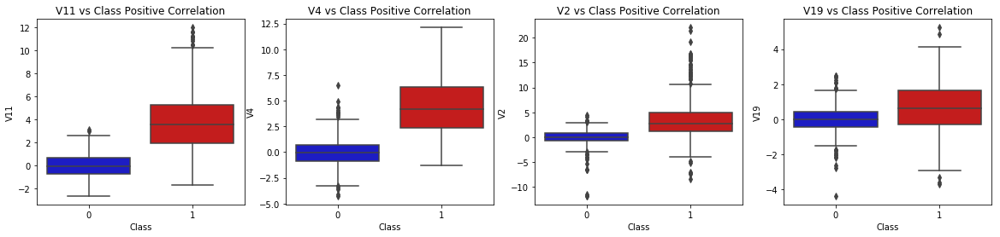
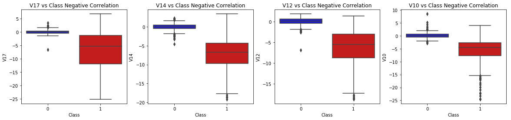
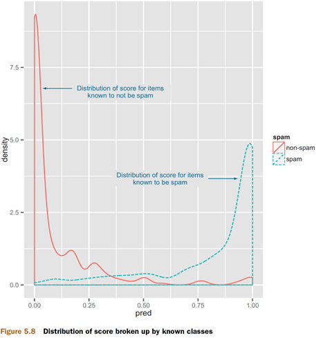
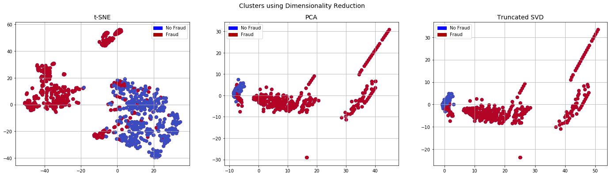
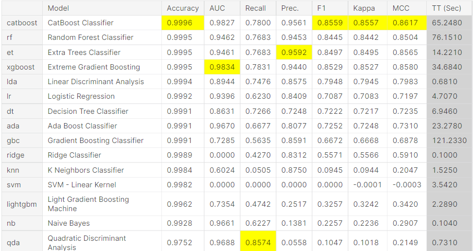

# 2021.12.21 - DS 第一次開會 - 方向與分工

# 資訊統整

---

## 欄位說明

- **Time**: 與第一筆資料間隔的秒數
- **Amount**: 交易金額
- **Class**: 是否為詐欺交易，1代表詐欺交易
- **V1 ~ V28**: PCA 特徵

## 主要問題與解法

### 標準化

> 對數值型資料標準化，是做機器學習必要的前置動作，確保模型不會因為各欄位的數值範圍與單位大小不同，導致模型會偏向某些數值較大的欄位。
> 
- PCA 的欄位本身已經做過標準化。
- Time 、Amount 要做

### 極端值

> 如果資料中有極端值，模型會不太好去找到資料的 pattern，可能被某些極端值拉走。
> 
- **別人作法 → 移除與預測目標相關性高的極端值**
    - Our main aim in this section is to remove "extreme outliers" from features that have a high correlation with our classes. This will have a positive impact on the accuracy of our models.
    (這篇的作法: **[Credit Fraud || Dealing with Imbalanced Datasets](https://www.kaggle.com/janiobachmann/credit-fraud-dealing-with-imbalanced-datasets)** )
    - 使用四分位數 & boxplot 去觀察極端值與設定門檻
- ⭐ **Outlier Removal Tradeoff  移除極端值的門檻設定對模型分類的影響與取捨。**
    1. 對於極端值前置條件:  當資料超過 IQR 時，才算極端值。需要設定一個適合門檻。可以繪製一個取線去找門檻。 x 為不同 倍數 IQR為條件移除的極端值，y 為模型效果的評估值。
        - 補充: 四分位間距（interquartile range，簡稱IQR）= ${\displaystyle (Q3-Q1)}{\displaystyle (Q3-Q1)}$ （即ΔQ）。一般來說 1.5×IQR ~ 3×IQR範圍的數值，稱作適度離群值（mild outlier）。
        數值位於範圍外3×IQR以上的數值，稱作極端離群值（extreme outlier）。
        
        ❓要全部一起做?還是每個欄位各自做?
        
    2. 相關性高的極端值對模型結果的影響: 只要達到條件就排除和只排除與目標相關性高的欄位



### 資料不平衡

> 在資料不平衡的情況下，模型可能會傾向預測比較多的那一類(0)，畢竟對模型來說不用動腦全部用猜0就可以得到很高的準確率。所以在這情況下，準確率沒甚麼參考性。所以我們需要鼓勵模型多去猜 1。
> 
- ⭐ **under sampling**
    - 可以使用under sampling的方式，也就是說在訓練模型時只抽取部分0的資料去實作，一般來說取的 0 越少 precision 會下降，recall會上升。
    → *所以要找到一個平衡點，雖然能找到大部分的1，但是模型每猜10個只中一個1，那未必是個好模型。*
    - under sampling 可以實驗的項目
        - 抽樣方式 → 直接隨機 or 分群隨機
        - 不同的比例 → 我們可以透過抽取1的數量控制1與0的比例，測試不同比例組成的訓練集對模型的效果
- **over sampling**
    - 增加 1 的樣本，這方式可以測試看看
- ⭐ **使用雙層 model**
    - 第一個 model 負責找到所有的1。也就是說，他只要有辦法先把不可能是1的排除，所以主要是看 recall 。此作法有點變相的 under sampling ，它可以降低資料中 1的比例。
    - 第二個 model 則可以在更好的環境下去找出真的是詐欺的交易

### 機率預測門檻

> 模型預測的機率需要超過多少才視為詐欺?
> 
- ⭐ 可以話雙曲線圖，x軸為模型預測的機率值(設定bin)，y為數量累積。

```r
ggplot(data=spamTest) + geom_density(aes(x=pred,color=spam,linetype=spam))
```



### 新特徵的建立

- ⭐ 在時間上會不會有甚麼規律?
    - 如果詐欺交易在時間上有句集的趨勢就可以建立像是該筆交易前 5 秒內有沒有其他詐欺交易的特徵
    - 有週期性的發生之類的，可能都在銀行下班後比較多。但是只有兩天資料可能看不太出來 😢
- ⭐ Amount 的類別化，會不會在某些金額區間，詐欺交易發生的頻率較高。

### 降維與分群

> 透過降為演算法可能可以讓詐欺與非詐欺資料分得更好，但需要測試看看，下圖使用不同演算法將資料降到 2維，並呈現詐欺與非詐欺資料的分布
> 





### 評估指標選擇

> 不同評估指標背後的涵義不一樣，評估指標不一定只用一個，我們可以跑多個去比較與解釋
> 
- 主辦單位推薦 → Area Under the Precision-Recall Curve (AUPRC)
- 也可以使用 → f1-score, precision/recall score or confusion matrix
- 老師教的 → topic3_measurement 70-83

## 模型

在 [這個](https://www.kaggle.com/arbazkhan971/credit-card-eda-25-models-for-beginners) notebook 有比較常用的幾個模型，因為是在 python 實作所以有些模型不一定在 R 可以找到。但我覺得這部分大概挑個 3-5 個模型做比較，可以挑幾個常見的 random forest、logic 回歸、knn。



模型效果比較

## 實作架構

1. 資料集介紹與主要的挑戰
2. EDA
    - 不同欄位的分布
    - 相關性分析 → 變數間熱圖、變數對目標類別的箱型圖
        
3. 評估指標的選擇(為什麼我們要使用這些指標)
4. 不同問題的實驗與處理
    - 資料不平衡
    - 極端值
    - 預測門檻
    - 新特徵的建立
    - 使用降維方式分群
5. 不同模型的測試與比較
6. 結論

# 會議記錄

---

### 分工

- 報告、簡報和前三章
    - 葉又瑄
    - 鮑蕾雅
    - 林佑彥
- 後三張:
    - 陳偉瑄
    - 何彥南

# 參考資源

---

## 整理許多不同模型測試

[Credit Card Fraud Detection](https://www.kaggle.com/mlg-ulb/creditcardfraud/discussion/277570)

## 不平衡資料與極端值處理(詳細說明)

[Credit Fraud || Dealing with Imbalanced Datasets](https://www.kaggle.com/janiobachmann/credit-fraud-dealing-with-imbalanced-datasets)

[信用卡詐騙分析-不平衡資料分析與處理kernel-完整版](https://medium.com/%E6%A9%9F%E5%99%A8%E5%AD%B8%E7%BF%92%E7%9F%A5%E8%AD%98%E6%AD%B7%E7%A8%8B/%E4%BF%A1%E7%94%A8%E5%8D%A1%E8%A9%90%E9%A8%99%E5%88%86%E6%9E%90-%E4%B8%8D%E5%B9%B3%E8%A1%A1%E8%B3%87%E6%96%99%E5%88%86%E6%9E%90%E8%88%87%E8%99%95%E7%90%86kernel%E7%BF%BB%E8%AD%AFpart1-7f1b0a645f9a)

## R 的實作範例

[Credit Card Fraud Detection with R + (sampling)](https://www.kaggle.com/atharvaingle/credit-card-fraud-detection-with-r-sampling)